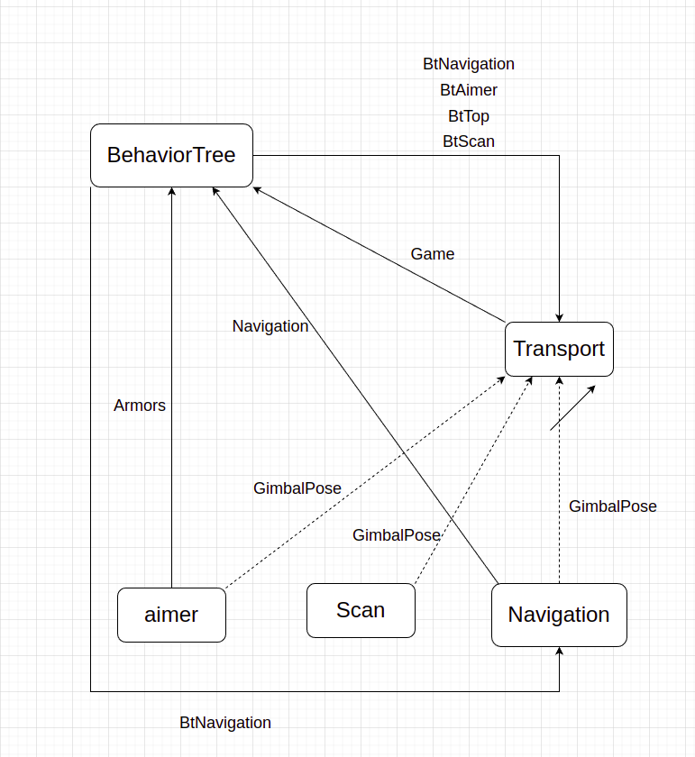
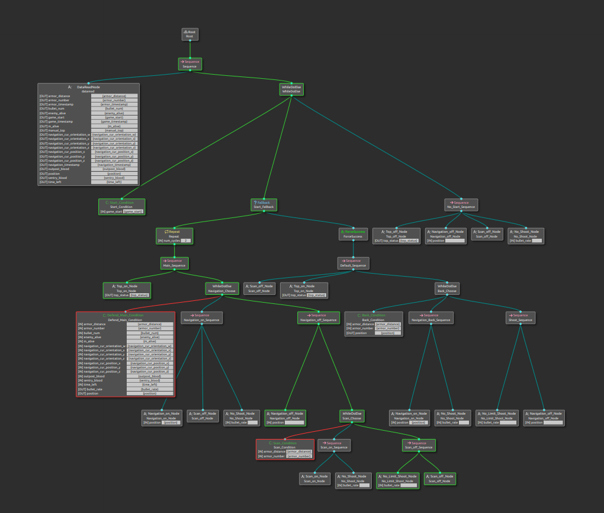

# 行为树 v2.0

~~**目前整棵树为Sequence结构，执行 `DataReadNode` , `Top_Node` , `Detect_Node` , `Navigation_Node`后处理回调.**~~

**v1.2调整： 目前整颗树以拆分出一个个组成节点，包含八个动作节点和三个条件节点，可任意组合形成树**

**v1.3调整: 增加了Scan节点，目前包含十个动作节点和七个条件节点，整颗树的逻辑重新进行了调整**

**v2.0调整：单独增加了联盟赛行为树，同时通过给地址直接控制导航节点，通过提前写入参数文件可以实现巡逻功能。对defend_main_condition内部结构进行了优化,attack_main_condition还未调整**

后期调试主要注意变量初始化问题

**依赖** ：  `behaviortree_cpp`   `OpenCV`    `base_interfaces`  `rclcpp` `ament_cmake`

**运行** ：正常ros2结点运行，可写入launch文件中。

`colcon build`  

`source ` 工作空间install目录

`ros2 run behavior_tree behaviortree `

### 1.行为树与其他节点沟通



行为树需要获取 `Armors`  , `Navigation` ,  `Game` 接口内信息，处理后以四个BT信息发给通讯 ， 同时将BtNavigation信息直接发给导航节点。

### 2.全国赛行为树架构


### 3. 联盟赛行为树架构

### 4.ROS订阅发布：

```c++
//subscription:
Armors   Game   Navigation     

//publisher
BtAimer  BtTop  BtNavigation  BtScan

//Armors    从自瞄节点获取，使用接口: Armors.msg
struct Armor_msg
    {
        int armor_number;       // 识别到的装甲板的数量
        double armor_distance;  // 最近的装甲板的距离
        double armor_timestamp; // 装甲板时间戳
    };

//Game    从通讯节点获取,使用接口：Game.msg
 struct Game_msg
    {
        int outpost_blood;        // 前哨站血量
        int sentry_blood;         // 哨兵血量
        int bullet_num;           // 剩余子弹数目
        int time_left;            // 剩余比赛时间
        double game_timestamp;    // 比赛状况事件戳
        bool manual_top;          // 是否手动开启小陀螺
        bool game_start;          // 比赛是否开始
        int m_alive;              // 我方存活机器人
        int enemy_alive;          // 敌方存活机器人
    };

//Navigation   从通讯节点获取,使用接口：Game.msg中的 Navigation
struct Navigation_msg
    {
        double navigation_timestamp;          // 导航事件戳
        int navigation_position;              // 当前目标位置
        geometry_msgs::msg::PoseStamped cur_position;   // 当前导航位置,内含下列元素：
        (double navigation_cur_position_x; 
        double navigation_cur_position_y;
        double navigation_cur_position_z;
        double navigation_cur_orientation_x;
        double navigation_cur_orientation_y;
        double navigation_cur_orientation_z;
        double navigation_cur_orientation_w;)
    };

// BtAimer   发向通讯节点,使用接口: BtAimer.msg
bullet_rate   // 射速，-1时不开启自瞄


// BtTop    发向通讯节点,使用接口: BtTop.msg
top_status    // 小陀螺状态

// BtNavigation  发向导航节点,使用接口: BtNavigation.msg
bool navigation_continue;  // 导航是否继续
geometry_msgs::msg::PoseStamped goal_position;  // 目标位置

// BtScan  发向通讯节点，使用接口： BtScan.msg
bool scan_on;  // 是否开启扫描
```


### 5.行为树内部entry

```c++
armor_number="{armor_number}"               // 识别到的装甲板的数量
armor_distance="{armor_distance}"           // 最近的装甲板的距离
armor_timestamp="{armor_timestamp}"         // 装甲板时间戳
            
navigation_timestamp="{navigation_timestamp}"  // 导航事件戳
navigation_cur_position_xxxx="{navigation_cur_position_xxxx}"     // 当前导航位置
navigation_position;                        // 当前目标位置

outpost_blood="{outpost_blood}"             // 前哨站血量
sentry_blood="{sentry_blood}"               // 哨兵血量
            
bullet_num="{bullet_num}"                   // 剩余子弹数目
time_left="{time_left}"                     // 剩余比赛时间
game_timestamp="{game_timestamp}"           // 比赛状况事件戳
manual_top="{manual_top}"                   // 是否手动开启小陀螺
```


