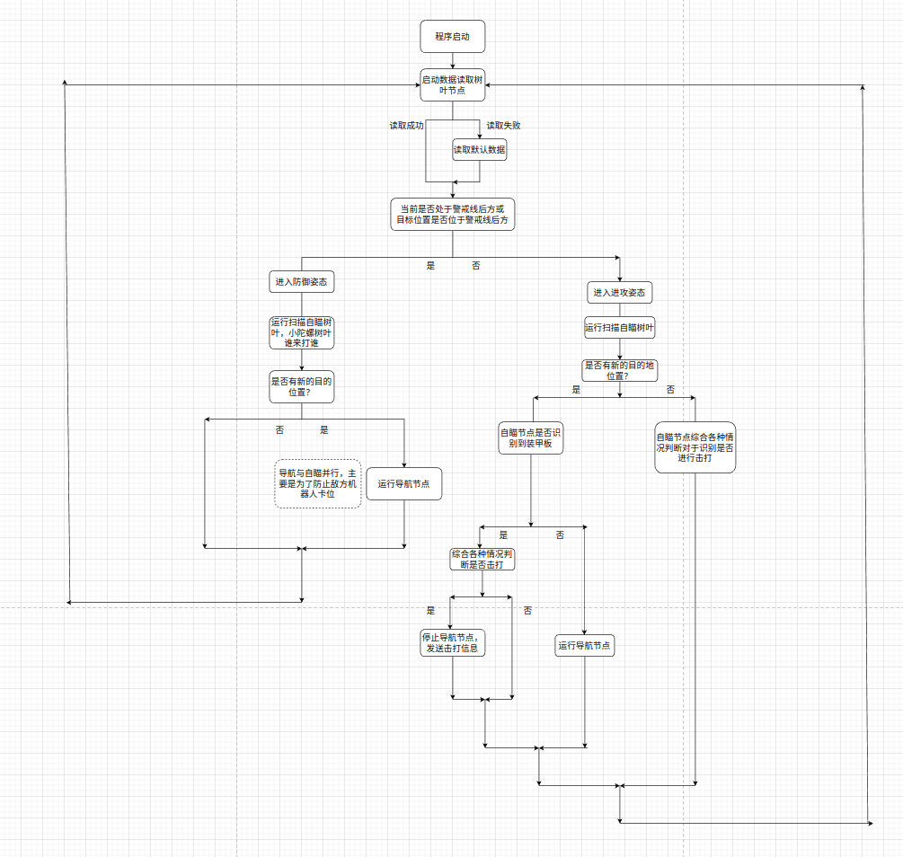
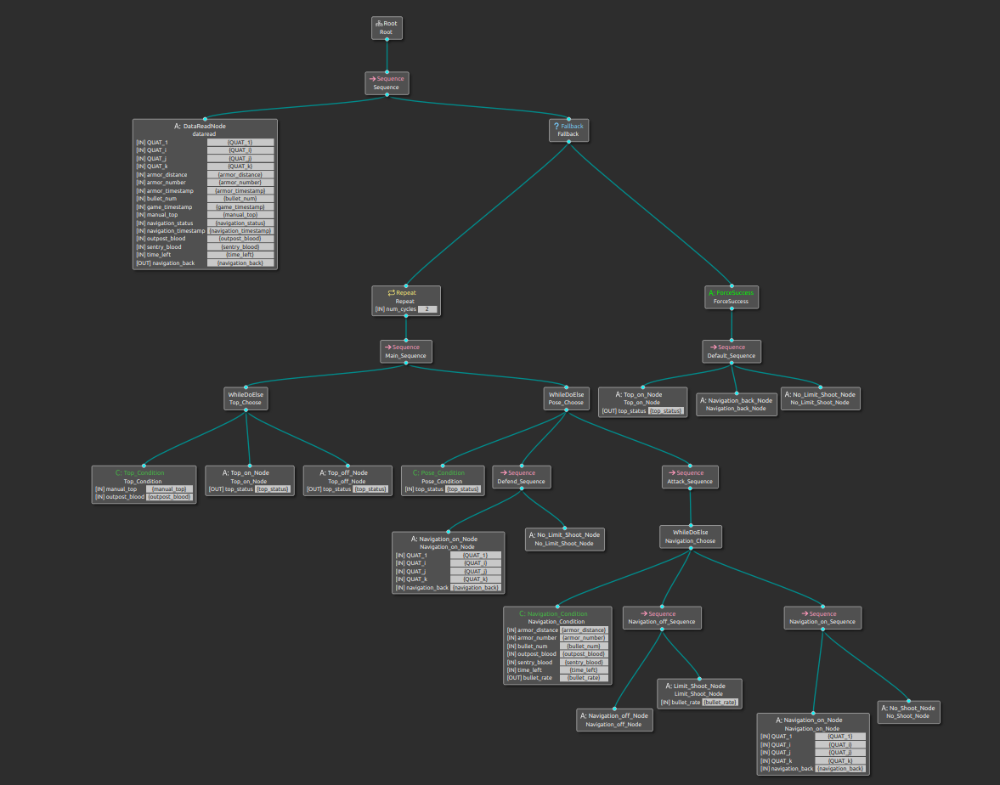

# 行为树 v1.0

**目前整棵树为Sequence结构，执行 `DataReadNode` , `Top_Node` , `Detect_Node` , `Navigation_Node`后处理回调.** 


###1.ROS订阅发布：

```c++
//subscription:
Armors   Game   Navigation     

//publisher
BT_shooter  BT_top  BT_navigation

//Armors    从自瞄节点获取，使用接口: Armors.msg
struct Armor_msg
    {
        int armor_number;       // 识别到的装甲板的数量
        double armor_distance;  // 最近的装甲板的距离
        double armor_timestamp; // 装甲板时间戳
    };

//Game    从通讯节点获取,使用接口：Game.msg
 struct Game_msg
    {
        double outpost_blood;  // 前哨站血量
        double sentry_blood;   // 哨兵血量
        int bullet_num；       // 剩余子弹数目
        double time_left;      // 剩余比赛时间
        double game_timestamp; // 比赛状况事件戳
        bool manual_top;       // 是否手动开启小陀螺
    };

//Navigation   从通讯节点获取,使用接口：Game.msg中的 Navigation
struct Navigation_msg
    {
        double QUAT_1;   // 四元数实数
        double QUAT_i;   // 四元数虚数部分
        double QUAT_j;
        double QUAT_k;
        double navigation_timestamp; // 导航事件戳
        bool navigation_status;   // 当前导航状态，true表示正在移动
    };

//BT_shooter   发向通讯节点,使用接口: Shooter.msg
bullet_rate   // 射速

//BT_top    发向通讯节点,使用接口: Top.msg
top_status  // 小陀螺状态

//BT_navigation  发向导航节点,使用接口: Navigation.msg
double QUAT_1;   // 四元数实数
double QUAT_i;   // 四元数虚数部分
double QUAT_j;
double QUAT_k;
```


### 2.行为树内部entry

```xml
<
armor_number="{armor_number}"               // 识别到的装甲板的数量
armor_distance="{armor_distance}"           // 最近的装甲板的距离
armor_timestamp="{armor_timestamp}"         // 装甲板时间戳
 
QUAT_1="{QUAT_1}"                  // 四元数实数
QUAT_i="{QUAT_i}"                  // 四元数虚数部分
QUAT_j="{QUAT_j}" 
QUAT_k="{QUAT_k}" 
            
navigation_timestamp="{navigation_timestamp}"  // 导航事件戳
navigation_status="{navigation_status}"        // 当前导航状态，true表示正在移动
            
outpost_blood="{outpost_blood}"             // 前哨站血量
sentry_blood="{sentry_blood}"               // 哨兵血量
            
bullet_num="{bullet_num}"                   // 剩余子弹数目
time_left="{time_left}"                     // 剩余比赛时间
game_timestamp="{game_timestamp}"           // 比赛状况事件戳
manual_top="{manual_top}"                   // 是否手动开启小陀螺
/>
```


###3. 行为树逻辑




### 4.架构



